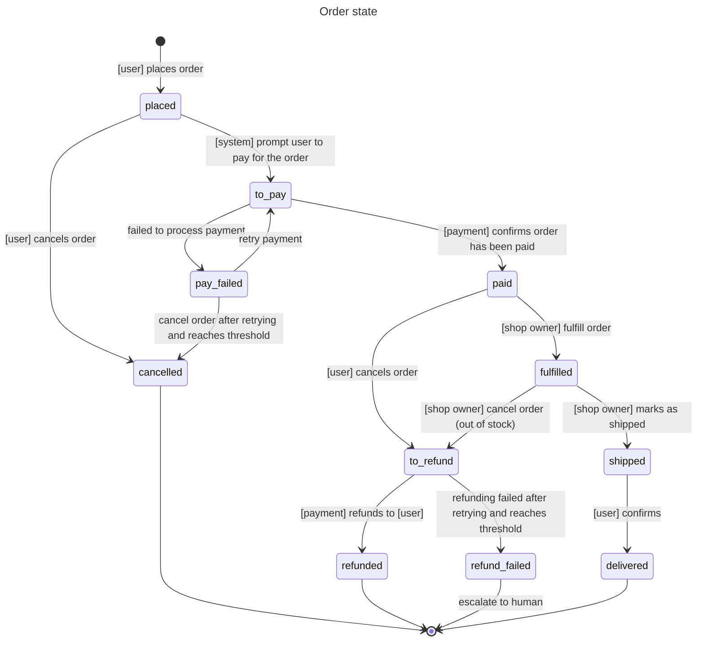

```mermaid
---
title: Order state
---
stateDiagram
  [*] --> placed: [user] places order
  placed --> cancelled: [user] cancels order
  cancelled --> [*]

  placed --> to_pay: [system] prompt user to pay for the order
  to_pay --> paid: [payment] confirms order has been paid
  to_pay --> pay_failed: failed to process payment
  pay_failed --> to_pay: retry payment
  pay_failed --> cancelled: cancel order after retrying and reaches threshold

  paid --> to_refund: [user] cancels order

  paid --> fulfilled: [shop owner] fulfill order
  fulfilled --> to_refund: [shop owner] cancel order (out of stock)

  to_refund --> refunded: [payment] refunds to [user]
  to_refund --> refund_failed: refunding failed after retrying and reaches threshold
  refunded --> [*]
  refund_failed --> [*]: escalate to human

  fulfilled --> shipped: [shop owner] marks as shipped
  shipped --> delivered: [user] confirms
  delivered --> [*]
```

